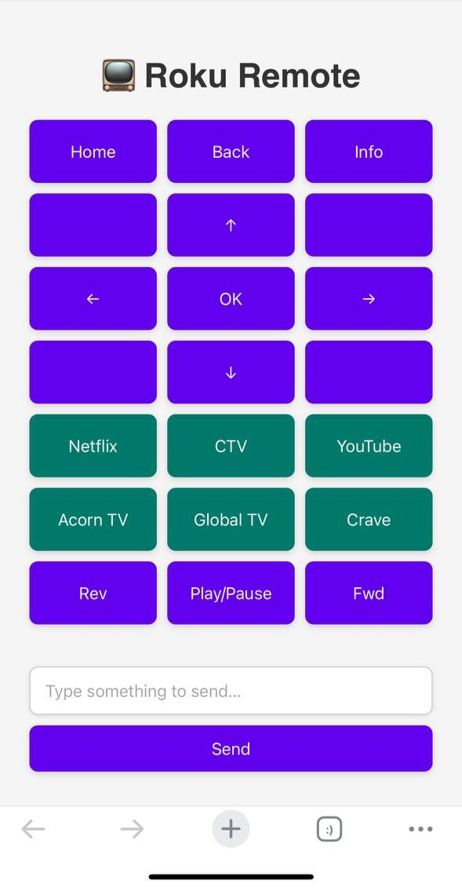

# 📺 Digital Roku Remote

A lightweight, mobile-friendly Roku remote you can host locally and use on any device with a browser. Whether your physical remote is lost in the couch, isn't as responsive anymore, out of batteries, or, like me, you're tired of the ol' lean over the coffee table and aim the remote routine, this touch-optimized web app keeps you in control of your Roku.

<p align="center">

</p>

## 🚀 Features

- 📱 Responsive design for phones, tablets, and desktops  
- ⌨️ Type 10× faster than using the on-screen Roku keyboard  
- 🟣 Sleek grid layout with intuitive buttons  
- 🌐 Works over your local network - no line of sight required
- 🧠 Built with vanilla HTML, CSS, and JavaScript  
- ⚡ Instant setup - no dependencies or installation needed  

---

## 🛠️ Getting Started

1. Clone or download this repo:

   ```bash
   git clone https://github.com/angushf/digital-roku-remote.git
   cd digital-roku-remote
   ```

2. Start a simple local web server (recommended for full functionality) and choose a port number.  
   If you have Python 3 installed, run:

   ```bash
   python3 -m http.server xxxx
   ```

   Then visit [http://localhost:xxxx](http://localhost:xxxx) in your browser.

3. Find your Roku's IP address:
   - Use your router admin panel **or**
   - Run a port scan with `nmap` (Roku typically listens on port 8060):

     ```bash
     nmap -p 8060 --open 192.168.1.0/24
     ```

4. In `script.js`, update the Roku IP address:

   ```js
   const ROKU_IP = "192.168.x.x"; // Replace with your Roku's local IP
   ```

5. That's it - you're now in control!

## 📦 Project Structure

```bash
digital-roku-remote/
├── LICENSE                        # MIT License
├── README.md                      # Project overview and setup instructions
├── digital-roku-remote-screenshot # Screenshot for README.md
├── index.html                     # Main UI layout
├── script.js                      # Button-to-Roku command logic
└── style.css                      # Grid layout and theming

```

---

## 🎯 Supported Roku Commands

Supports most Roku keypresses such as:

- Home  
- Back 
- Info 
- OK  
- Play/Pause  
- Reverse/Forward
- Directional arrows  
- Channel buttons (Netflix, Global TV, Acorn TV, Youtube, Crave, CTV)

Feel free to extend it using Roku’s ECP (External Control Protocol):  
https://developer.roku.com/docs/developer-program/debugging/external-control-api.md

---

## 🧪 Demo

Demo to come!

---

## 📄 License

This project is licensed under the MIT License. See the [LICENSE](./LICENSE) file for details.

---

## ✨ Future Ideas

- Add volume controls to non-Roku TV's (if supported)
- Add power on/off button (unsure if Roku device is discoverable its port when off)

---

## 🙌 Credits

Built by [Angus Hardy-Francis](https://github.com/angushf) out of pure remote-related frustration and not wanting to do the ol' lean over the coffee table and aim the remote routine anymore. ❤️
